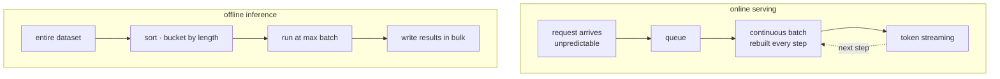
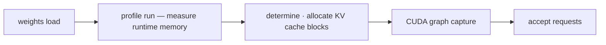
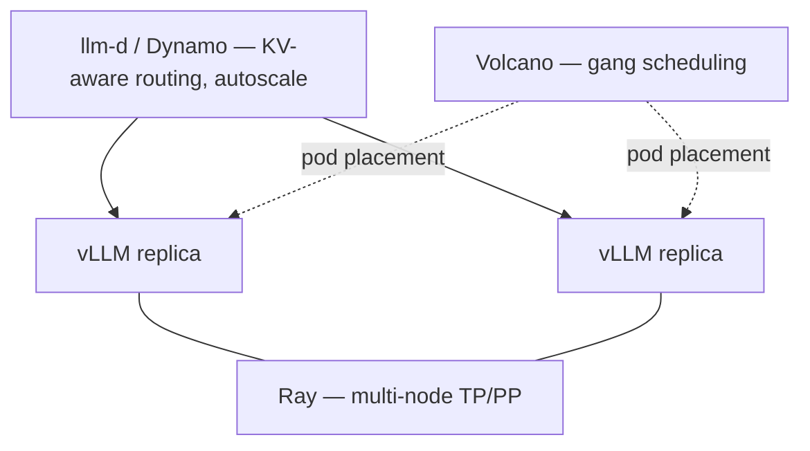
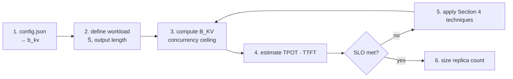

> As demand for AI grows, more teams are standing up a modern LLM serving engine of their own. This post records where things stand at the moment — the decisions that go into building a serving environment for autoregressive LLMs, and the considerations that are already well established by now. Modality and low-level performance techniques are out of scope.

## 1. What Actually Deploys?

Deploying a model is not a matter of moving one weight file. All five of the following have to be present for the model to produce the same output it did during training.

| Component | File | What breaks without it |
|---|---|---|
| Weights | `*.safetensors` | The model cannot run |
| Architecture definition | `config.json` | No way to know which graph the weights belong to |
| Tokenizer | `tokenizer.json`, `tokenizer_config.json` | The same sentence maps to a different token sequence |
| Chat format | chat template | The model receives prompts in a different format than it was trained on |
| Execution code | runtime + kernels | The same weights can differ in throughput by tens of times |

```text
meta-llama/Llama-3.1-8B-Instruct/
├── config.json                  # architecture — input to the calculations in Section 3
├── generation_config.json       # sampling defaults
├── model-0000{1..4}-of-00004.safetensors   # weights, 16.1 GB
├── model.safetensors.index.json # tensor-to-file mapping
├── tokenizer.json
└── tokenizer_config.json        # includes the chat template
```

From a serving standpoint the most important file is `config.json`. Before launching the model, this file alone determines how many GPUs are needed and how many concurrent requests the deployment can accept.

```json
{
  "num_hidden_layers": 32,
  "num_attention_heads": 32,
  "num_key_value_heads": 8,
  "head_dim": 128,
  "torch_dtype": "bfloat16"
}
```

| Field | What it determines for serving |
|---|---|
| `num_hidden_layers` | KV cache size scales with this value |
| `num_key_value_heads` | If smaller than `num_attention_heads`, the model uses GQA. KV cache shrinks by the ratio between the two |
| `head_dim` | KV cache size scales with this value |
| `torch_dtype` | Determines weight memory. bf16 means parameter count × 2 bytes |

The model above has 32 attention heads and 8 KV heads, so it uses GQA at a 4:1 ratio. With MHA it would need four times the KV cache.

Weight memory is the parameter count multiplied by a constant, and that is the end of it. KV cache additionally multiplies by concurrent request count and context length. That difference is why memory planning is harder in serving.

## 2. What a Serving Engine Does, and Why

### 2.1 Target Device

The same model has different optimization targets depending on where it runs.

| Mode | Constraint | Optimization target | Example |
|---|---|---|---|
| on-device | memory, power, thermals | model size, quantization | llama.cpp, CoreML |
| single-model | GPU memory | latency, throughput | a single vLLM replica |
| multi-model | isolation, model switch cost | GPU utilization, cold start | multi-adapter LoRA |
| platform | operational complexity | routing, autoscaling | KServe, llm-d, Ray Serve |

This post covers single-model through platform.

### 2.2 Online Serving vs Offline Inference

Online and offline inference use the same engine and the same model, but the considerations differ with how the workload is used. Requests fall into the two shapes below.



In online inference the batch cannot be assembled in advance. At the moment you decide which requests go onto the GPU, you do not know when the next request will arrive. The batch therefore has to be rebuilt every step (4.1), and once the arrival rate exceeds the service rate the queue grows and p99 latency collapses.

Offline inference starts with the full input known. Requests of similar length can be grouped together to eliminate padding waste, and since there is no latency target to meet, batch size can be pushed to the memory limit.

| | online | offline (batch) |
|---|---|---|
| Typical workload | chatbots, coding assistants, APIs | embedding generation, labeling, eval-set inference, bulk summarization |
| Objective | latency SLO (TTFT, TPOT) | throughput, cost per 1M tokens |
| Arrival pattern | stochastic, with peaks and troughs | deterministic, fully known upfront |
| Batch construction | continuous batching in arrival order | length-sorted, maximum batch |
| Streaming | required. Perceived speed is set by TTFT | not needed |
| Upper bound on batch size | the SLO | memory |
| Failure mode | queue blowup, p99 collapse | OOM |
| Scaling basis | peak traffic | deadline |

Section 3 onward is written from the online inference perspective. That said, the techniques in Section 4 have a larger effect on offline inference, because batch size can be raised to whatever memory allows rather than to whatever the SLO allows.

### 2.3 Startup Lifecycle

LLM serving diverges from conventional model deployment at startup, because the number of concurrent requests a replica can handle is fixed the moment startup completes.



The order matters. The engine runs one dummy forward pass to find out how much activation and execution buffer it needs, then pre-allocates all remaining memory as KV cache. CUDA graph capture happens after that. KV memory is not allocated per request; the full amount is reserved at startup.

Concurrency is therefore decided by a memory calculation at startup, not by traffic. This is also why a rolling update takes minutes. Weight loading, the profile run, and graph capture all have to be redone, and the prefix cache is empty for that entire window.

## 3. Three Bottlenecks Created by Autoregressive Generation

### 3.1 Recomputation

Autoregressive generation recomputes attention for every token it produces. Attention multiplies the current token's Query against the Key and Value of every previous token, so without a cache the entire history must be recomputed at every step. Generating $S$ tokens costs $O(S^2)$ in attention.

The KV cache eliminates this recomputation. The Key and Value tensors computed at each layer are kept in GPU memory, and the next step computes only the K and V for the single new token and appends them. Attention per step drops to $O(S)$, and per-token generation time becomes nearly constant regardless of context length.


*Source: NVIDIA, [Mastering LLM Techniques: Inference Optimization](https://developer.nvidia.com/blog/mastering-llm-techniques-inference-optimization/)*

This optimization trades compute for memory. The remaining two bottlenecks are the price of that trade.

### 3.2 KV Cache Memory — The Concurrency Ceiling

The KV cache stores a Key and a Value at every layer. The bytes consumed by a single token are:

$$b_{kv} = 2\,L\,H_{kv}\,d_h\,p_{kv}\ \ [\text{B/token}]$$

The leading 2 accounts for Key and Value. $L$ is the layer count, $H_{kv}$ the number of KV heads, $d_h$ the head dimension, and $p_{kv}$ the dtype size in bytes. The values from `config.json` in Section 1 plug in directly.

| Model | Attention | $L$ | $H_{kv}$ | $b_{kv}$ (fp16) |
|---|---|---|---|---|
| Llama-2-7B | MHA | 32 | 32 | 512 KiB/token |
| Llama-2-13B | MHA | 40 | 40 | 800 KiB/token |
| Llama-3.1-8B | GQA 4:1 | 32 | 8 | 128 KiB/token |
| Llama-3.1-70B | GQA 8:1 | 80 | 8 | 320 KiB/token |
| DeepSeek-V3 | MLA (latent 512 + rope 64) | 61 | — | ~69 KiB/token |

KV cache size is determined by layer count and KV head count, not by parameter count. That is why DeepSeek-V3 at 671B parameters uses less cache per token than Llama-2-7B at 7B parameters.

The per-token figure looks small, but two more terms multiply into it.

$$M_{kv}^{total} = b_{kv} \times \bar S \times B$$

Context length $\bar S$ and concurrent request count $B$ both multiply in, so the cache grows quickly. For Llama-2-7B at fp16 with 4096 tokens:

| Batch size | KV cache | Weights | Total |
|---|---|---|---|
| 1 | 2 GB | 14 GB | 16 GB |
| 4 | 8 GB | 14 GB | 22 GB |
| 8 | 16 GB | 14 GB | 30 GB |

At batch 8 the KV cache is larger than the weights. A component that does not exist during training takes up more than half of memory during serving. It also means a single A100 40GB cannot push the batch beyond 8.

Three terms multiply, so there are three axes to reduce. One of them should not be reduced.

| Axis | How to reduce it | Notes |
|---|---|---|
| Bytes per token $b_{kv}$ | MQA / GQA / MLA, KV quantization | 4.3, 4.4 |
| Context length $\bar S$ | sliding window attention, prefix reuse | SWA keeps only the most recent $W$ tokens, so the cache stops growing with context (4.3) |
| Concurrent requests $B$ | none | Reducing $B$ reduces throughput. The point of cutting the other two is to raise $B$ |

Dividing the KV memory the engine secured by what one request consumes gives the number of sequences that can run concurrently.

$$B_{KV} = \left\lfloor \frac{M_{gpu}u - M_w - M_{act}}{b_{kv}\,\bar S} \right\rfloor$$

$M_{gpu}u$ is the GPU memory granted to the engine, $M_w$ the weights, and $M_{act}$ the activations and execution buffers. Running Llama-3.1-8B at fp16 on an RTX 3090 24GB with a 1024-prompt + 256-output workload:

```text
M_w     = 8.03e9 × 2 B                                    = 15.0 GiB
M_act   = runtime memory (logits, CUDA graph, …), assumed ≈  2.0 GiB
M_kv    = 24 × 0.9 - 15.0 - 2.0                           =  4.6 GiB
1 seq   = 1280 tokens × 128 KiB                           = 0.156 GiB
B_KV    = 4.6 / 0.156                                     = 29
```

Twenty-nine concurrent requests. That is what a GQA-based 8B model gets on a 24GB card. Only 4.6 GiB of headroom remains, so a 1 GiB error in the $M_{act}$ estimate drops the figure from 29 to 23.

### 3.3 Prefill / Decode — Two Phases, Two Bottlenecks

Two phases with different characteristics run in sequence while a single request is served. Same model, same GPU, different bottleneck.

**The prefill phase** processes the entire input prompt at once to compute the K and V tensors. Every input token is already known, so tokens can be processed in parallel and the computation takes a matrix × matrix form. The GPU's compute units are well filled, which makes **arithmetic throughput the bottleneck**. The duration of this phase determines TTFT.

**The decode phase** generates tokens one at a time. Each step handles only one new token, so the computation takes a matrix × vector form. The problem is that computing that single token requires reading the entire model weights out of GPU memory. For an 8B model at fp16 that is 15 GiB per step. The arithmetic is worth one token while the bytes read stay the same, so the GPU spends its time waiting for data rather than computing. **Memory bandwidth is the bottleneck**, and this phase determines TPOT.

| | prefill | decode |
|---|---|---|
| Unit of work | whole prompt | 1 token × batch |
| Computation shape | matrix × matrix | matrix × vector |
| Bottleneck | arithmetic (compute-bound) | memory bandwidth (memory-bound) |
| Metric it determines | TTFT | TPOT |
| Direction of improvement | chunking, kernel efficiency | larger batch, fewer bytes read |

The fact that decode is bound by memory bandwidth is where batching gets its importance. If 29 requests are processed together while those 15 GiB of weights are read once, the read cost per request drops to 1/29. Decode efficiency is effectively determined by batch size.

But raising the batch requires KV cache memory (3.2). The batch for an 8B model on a 3090 stopping at 29 means there is no way to improve decode efficiency further without securing more KV memory. The memory constraint in 3.2 carries directly into the throughput constraint in 3.3.

Approximate figures for this workload are TPOT 26 ms (38 tok/s per sequence, 1,110 tok/s total) and TTFT 0.39 s.

## 4. Optimization Techniques

Mapping each technique onto the bottlenecks from Section 3 gives the following. Effects are stated against the 3090 / 8B / 1280-token workload above.

| Technique | Bottleneck addressed | Effect |
|---|---|---|
| Continuous Batching | idle slots (3.3) | effective occupancy 43.5% → near 100% |
| PagedAttention | reservation waste (3.2) | memory waste 60–80% → under 4% |
| GQA / MQA / MLA | $b_{kv}$ (3.2) | MHA 512 → GQA 128 KiB/token |
| Sliding Window Attention | $\bar S$ (3.2) | cache stops at $W$ as context grows |
| KV quantization (fp8) | $b_{kv}$ (3.2) | $B_{KV}$ 29 → 58 |
| Weight quantization (W4) | $M_w$ (3.2) | $B_{KV}$ 29 → 98 |
| Tensor Parallel (N=2) | $M_{kv}$, bandwidth (3.2, 3.3) | $B_{KV}$ 29 → 155, throughput 5.3× |
| Speculative Decoding | weight-read count (3.3) | 1 token per read → up to 4 |

Public benchmarks show what happens when several techniques are applied together. The results below come from changing only the batching strategy on the same GPU and model.

| Batching strategy | Relative throughput |
|---|---|
| static batching | 1× |
| optimized static (FasterTransformer) | 4× |
| continuous batching | 8× |
| continuous batching + PagedAttention (vLLM) | **23×** |

Anyscale benchmark, OPT-13B / A100 40GB, 1,000 requests with 512 input tokens. Of the 23×, the first 8× comes from scheduling and the rest from memory management. These numbers were obtained without modifying any kernel.

### 4.1 Continuous Batching

Static batching assembles a batch and keeps that composition until every request in it finishes. The problem is that output length varies per request. Slots belonging to already-finished requests sit empty and consume GPU steps until the longest request in the batch completes.

Grouping four requests with output lengths of 20 / 500 / 50 / 300 tokens into one static batch gives the following slot utilization over its 500 steps:

$$\frac{20+500+50+300}{4 \times 500} = 43.5\%$$

Continuous batching — called in-flight batching in TensorRT-LLM — rebuilds the batch every step. A finished sequence is evicted immediately and a waiting request takes its place. Requests also no longer wait for a batch to start.

One problem remains. Prefill processes hundreds of tokens at once, which makes a single step long. When a long prompt arrives, every decode in flight stalls for that step and other users see their TPOT spike. Chunked prefill splits the prefill into multiple chunks and interleaves them between decode steps to remove that stall.

### 4.2 PagedAttention

With contiguous allocation, a KV region of `max_model_len` has to be reserved when a request arrives, because there is no way to know how long the sequence will get. Even if the actual output is 200 tokens, space for 4096 is reserved and no other request can use it. The vLLM paper reports that existing systems wasted 60–80% of KV memory to this kind of over-reservation and fragmentation.

PagedAttention applies OS virtual-memory paging to the KV cache. The cache is divided into fixed-size blocks, the blocks are placed in physically non-contiguous locations, and a block table maps logical positions to physical ones. As a sequence grows, blocks are added one at a time.

With a block size of 16, one block is 2 MiB for Llama-3.1-8B, and waste per sequence is limited to the unused portion of the last block — at most 15 tokens, or 1.9 MiB. The waste ratio drops below 4%, and that recovered memory goes straight into $B_{KV}$.

Block-level management also makes reuse possible. Requests sharing the same prefix can share blocks by reference and skip that part of prefill entirely.

| Reuse scope | Technique | What it gains |
|---|---|---|
| Across requests | prefix caching, radix tree | TTFT reduced by the shared prefix |
| Beyond memory | CPU / storage offload | larger KV capacity, at the cost of transfer latency |
| Across replicas | KV-aware routing, P/D disaggregation | requests are sent to the replica holding the cache |

For workloads with long system prompts or few-shot examples, prefix cache hit rate has a large effect on throughput. That is why it belongs in the monitoring set in Section 6.

### 4.3 Attention Variants — MHA / MQA / GQA / MLA / SWA

Reducing $b_{kv}$ means changing the attention structure itself. These are decided at training time, so in serving they are a model-selection question rather than a configuration one.

**MHA (Multi-Head Attention)** creates Query, Key, and Value for every head. With 32 heads there are 32 sets of K and V. This gives the largest KV cache.

**MQA (Multi-Query Attention)** keeps one Query per head but only a single set of Key and Value. Every Query head shares the same K and V. The KV cache shrinks by the head count, and so do the bytes read during decode. The cost is reduced expressiveness, which can degrade quality.

**GQA (Grouped-Query Attention)** sits in between. Query heads are divided into groups, and each group gets one set of K and V. With 32 Query heads and 8 KV heads, four heads share one set and the KV cache becomes a quarter. Quality loss is smaller than MQA, which is why most recent models use it.

**MLA (Multi-head Latent Attention)** does not store K and V directly. It compresses them into a low-dimensional latent for storage and reconstructs them at use time. DeepSeek-V2/V3 use this approach, and as the earlier table shows, per-token cache is even smaller than GQA.

**SWA (Sliding Window Attention)** works on a different axis. Where the previous three reduce bytes per token, SWA limits how many tokens are stored. If each token attends only to the most recent $W$ tokens, anything older can be dropped from the cache. Mistral-7B uses $W$ = 4096 with a context of 8192, halving the cache. The key property is that the cache stops growing at $W$ no matter how long the context gets. Information outside the window still propagates indirectly through layers.

| Variant | KV head count | $b_{kv}$ at Llama-2-7B scale | Characteristics |
|---|---|---|---|
| MHA | same as Query heads | 512 KiB/token | quality baseline |
| GQA (4:1) | Query heads / 4 | 128 KiB/token | small quality loss. Current standard |
| MQA | 1 | 16 KiB/token | smallest, but quality degrades |
| MLA | latent compression | ~69 KiB/token (V3) | adds compress/reconstruct work |
| SWA | unchanged | fixed once context exceeds $W$ | caps $\bar S$ |

### 4.4 Quantization

Quantization represents numbers in fewer bits to reduce memory and bandwidth. Two things can be reduced in serving.

**Weight quantization** reduces $M_w$. Weights do not change during inference, so a single offline conversion is enough. AWQ and GPTQ are the common choices, and 4-bit against fp16 cuts memory to a quarter. Whatever is freed goes directly to the KV cache.

**KV cache quantization** reduces $b_{kv}$. Moving from fp16 to fp8 halves bytes per token. KV values are produced during inference, however, so outlier handling is harder than it is for weights.

| Configuration | $M_w$ | $b_{kv}$ | $M_{kv}$ | $B_{KV}$ |
|---|---|---|---|---|
| fp16 | 15.0 GiB | 128 KiB | 4.6 | 29 |
| `--kv-cache-dtype fp8` | 15.0 GiB | 64 KiB | 4.6 | 58 |
| W4 (AWQ/GPTQ) | 4.2 GiB | 128 KiB | 15.4 | 98 |
| W4 + KV fp8 | 4.2 GiB | 64 KiB | 15.4 | 197 |

From 29 to 197, a factor of 6.8.

Hardware support is the thing to watch. The RTX 3090 is Ampere and has no FP8 compute units, so both W4 and KV fp8 are read and then reconstructed to fp16 before computing. Compute speed does not improve at all. The gain still appears because decode is bound by memory bandwidth (3.3) — fewer bytes read means a shorter step. That asymmetry is the reason low precision works in serving.

Sparsity and distillation belong to the same family. The former zeroes out near-zero weights for compression; the latter transfers knowledge from a large model into a smaller one. Both reduce $M_w$ at the cost of some accuracy.

### 4.5 Speculative Decoding

Section 3.3 established that decode efficiency is determined by batch size, and raising the batch requires KV memory. Without memory, this is where it stops.

Speculative decoding takes a different route. A small, fast draft model generates $\gamma$ tokens first, and the main model verifies all $\gamma$ in a single forward pass. Verification is parallelizable, so it takes a computation shape closer to prefill. The result is that **one weight read can confirm up to $\gamma{+}1$ tokens**.

Tokens the draft got wrong are discarded and regenerated from that point, so the real gain scales with the acceptance rate. Drafts can come from a separate small model, or from extra prediction heads fine-tuned onto the main model.

Because it raises per-step throughput without consuming additional KV memory, it is one of the few options available when memory is the binding constraint.

### 4.6 Parallelism — Tensor / Pipeline

Multiple GPUs come in when the model does not fit on one card, or when it fits but leaves too little room for KV cache. There are two directions to split along.

**Pipeline Parallelism (PP)** splits the model vertically by layer. In a 4-way split each GPU holds a quarter of the layers and a quarter of the weight memory. The problem is that a downstream GPU cannot start until the upstream one finishes, which creates idle intervals known as pipeline bubbles. Splitting input into micro-batches reduces them but does not remove them.

**Tensor Parallelism (TP)** splits horizontally inside each layer. MLP weight matrices are partitioned column-wise or row-wise so each GPU computes a partial result, and attention is split by head. Every GPU works simultaneously, so there is no bubble, but each layer needs an all-reduce to combine results.

TP is the first choice in serving because KV capacity grows faster than the GPU count. Weights are divided by the number of GPUs while free memory per GPU is multiplied by it.

```text
TP=1:  M_kv = 21.6 - 15.0 - 2.0        =  4.6 GiB  → B_KV =  29  → 1,110 tok/s
TP=2:  M_kv = 2 × (21.6 - 7.5 - 2.0)   = 24.2 GiB  → B_KV = 155  → 5,870 tok/s
                                                       5.3x        5.3x
```

Twice the GPUs, 5.3× the throughput. Memory was the binding constraint, so the batch could grow substantially.

There are two reasons this cannot be scaled indefinitely. First, an all-reduce is attached to every layer, so communication cost starts to dominate as the GPU count rises. Second, attention splits by head, and a GQA model has only 8 KV heads. Setting TP above 8 requires replicating KV heads, and the KV memory benefit disappears at that point.

### 4.7 FlashAttention

FlashAttention reorganizes the attention computation to match the GPU memory hierarchy. Instead of writing the $S \times S$ intermediate matrix to HBM, it tiles the computation and completes each tile inside SRAM. The result is mathematically identical to standard attention, so no model changes are required.

The gain shows up in prefill. Longer prompts produce larger intermediate matrices, so both memory usage and TTFT improve.

Decode is a different case. Processing a single token produces a $1 \times S$ intermediate, which is not large to begin with. Improvement on the decode side comes from FlashDecoding, which splits the KV into segments and reads them in parallel to reduce latency at small batch sizes.

Both are kernel-layer optimizations, and engines select them automatically based on the hardware. There is rarely a reason to choose them explicitly in a serving configuration.

## 5. Metrics and SLOs

| Metric | Definition | Governing phase |
|---|---|---|
| TTFT | request arrival to first token | prefill |
| TPOT (ITL) | interval between tokens | decode |
| E2E latency | request arrival to last token | mostly decode |
| Throughput | tokens per second or requests per second | — |
| Goodput | throughput counting only SLO-satisfying requests | — |

The target value for TPOT comes from human reading speed. One English word is roughly 1.5 tokens, so converting words per minute (WPM) into tokens per second gives the required TPOT.

| Reader | WPM | Required tok/s | TPOT |
|---|---|---|---|
| Average | 250 | 6.3 | 160 ms |
| Fast | 400 | 10.0 | 100 ms |
| Very fast | 700 | 17.5 | 57 ms |

This table is the basis for the conventional TPOT target of 50–100 ms. Beyond that, people cannot read any faster, so the remaining bandwidth is better spent raising batch size for throughput.

There are three reasons to track several metrics rather than one.

- Users perceive two separate moments: the wait until the first character appears, and the speed of reading afterward. The bottlenecks differ as well (3.3), so they cannot be collapsed into a single latency metric.
- Output length is unknown in advance, so request cost is a distribution rather than a value. An SLO set on the mean passes even when half of requests violate it. It has to be set on p95 or p99.
- Raising throughput alone improves the number while breaking the SLO. A larger batch increases tokens per second but worsens per-user TPOT. Goodput avoids this by counting only requests that met the SLO.

Streaming and batching move different metrics.

| | What it improves | What it does not |
|---|---|---|
| streaming | perceived start time. TTFT becomes the SLO target | total throughput, total generation time |
| batching | throughput | per-user TPOT, which gets worse |

One caution when estimating arrival rate: the value from `concurrency ÷ E2E latency` is the saturation point at utilization 1. At that point queue length diverges and p99 TTFT is dominated by wait time rather than prefill time. The operating target is normally set at about 70% of that value.

## 6. Observability

GPU utilization at 100% does not mean the GPU is doing work; it means a kernel is resident. Decode spends its time reading weights from memory, so utilization reads high even while compute units sit idle.

Two layers therefore have to be viewed together.

| Layer | Typical tooling | What it shows |
|---|---|---|
| Hardware | DCGM exporter | compute-unit activity, memory bandwidth, memory occupancy, interconnect and power |
| Engine | vLLM `/metrics` | queue length, KV occupancy, preemption, prefix cache hit rate, TTFT/TPOT distributions |

Hardware metrics alone stop the diagnosis at "the GPU is busy, so why is it slow." Engine metrics are what separate the causes.

| Symptom | Diagnosis |
|---|---|
| Preemption occurring | KV ceiling exceeded. Apply the techniques in Section 4 |
| TTFT up + queue growing + KV occupancy saturated | capacity shortfall. Add replicas |
| TTFT up + queue growing + KV occupancy low | scheduler or routing problem |
| TPOT up + KV occupancy low | batch is too large |
| Prefix cache hit rate dropping sharply | requests are being routed to replicas without the cache |

Preemption is the signal worth watching most. KV occupancy at 90% is normal operation, but preemption means a running sequence was evicted for lack of memory and will be recomputed later.

## 7. The Serving Stack

### 7.1 Engines

The engine implements the techniques in Section 4. Serving without one means building the continuous batching scheduler, KV block allocation and reclamation, chunked prefill, parallelism wiring, CUDA graphs, sampling, the API, and metrics yourself.

| Engine | Characteristics | Where it fits |
|---|---|---|
| vLLM | PagedAttention, broad model coverage, HF ecosystem integration | default choice |
| SGLang | RadixAttention-based KV reuse, structured output | workloads with heavy prefix reuse |
| TensorRT-LLM | strong kernel tuning and quantization. Requires per-model engine builds | NVIDIA-only, maximum performance |
| llama.cpp | CPU execution and low memory use, GGUF format | on-device |

In the NVIDIA stack, TensorRT-LLM serves as the engine and Triton Inference Server handles request processing and deployment above it.

Most of the terms from Section 3 map to a single engine flag.

| Term | vLLM flag |
|---|---|
| Concurrency ceiling | `--max-num-seqs` |
| Prefill/decode mix ratio | `--enable-chunked-prefill`, `--max-num-batched-tokens` |
| Upper bound on $\bar S$ | `--max-model-len` |
| Effective $\bar S$ | `--enable-prefix-caching` |
| GPU memory fraction $u$ | `--gpu-memory-utilization` |
| $b_{kv}$ | `--kv-cache-dtype fp8` |
| $M_w$ | `--quantization awq` / `gptq` |
| GPU count | `--tensor-parallel-size`, `--pipeline-parallel-size` |
| Draft length $\gamma$ | `--speculative-config` |

### 7.2 Above the Engine

vLLM, Ray, Volcano, and llm-d are not alternatives to each other. They occupy different layers.

| Layer | Responsibility | Examples |
|---|---|---|
| Engine | single-replica execution, batching, KV management | vLLM, SGLang, TensorRT-LLM |
| Distributed runtime | multi-node process placement, TP/PP wiring | Ray |
| Batch scheduler | gang scheduling, queues and quotas, GPU allocation | Volcano, Kueue |
| Serving orchestration | KV-aware routing, P/D separation, autoscaling | llm-d, Dynamo, Ray Serve |



Combining the stacks described above yields roughly the service design shown here. This is not an absolute structure; it is one arrangement based on what each piece of software does. Kueue can replace Volcano, the Ray layer can be dropped when a single node is sufficient, and running the engine alone without any orchestration is also a valid configuration.

The reason for separating layers is that the unit of scaling differs. Routing and API handling are CPU work while the engine is GPU work, so which side is under load changes with the situation. Ray Serve LLM keeps these as separate deployments and scales each independently, suggesting ingress : replica = 2 : 1 as a starting ratio. Separating prefill and decode follows the same pattern: their bottlenecks differ (3.3), so the deployments are split and each is scaled only as much as it needs.

Routing has to account for the prefix cache. The prefix cache from 4.2 lives in each engine replica's GPU memory, so its contents differ per replica. If requests sharing the same system prompt land on a different replica each time, the cache exists but is never reused. This is why the orchestration layer tracks which replica holds which prefix and routes requests accordingly — KV-aware routing.

On Kubernetes this becomes a Service configuration question. Default load balancing distributes requests evenly, which breaks cache locality. Enabling session affinity or consistent hashing so that requests with the same prefix reach the same Pod, or placing a cache-aware router in front, may be necessary. The size of the benefit varies with the workload, so measuring hit rate before deciding is the better approach.

## 8. Capacity Planning Recipe

Reorganizing the preceding sections into an actual sizing sequence gives the following. Steps 1–3 can be done from `config.json` and workload assumptions alone; step 4 onward requires hardware specifications.



| Step | Input | Output |
|---|---|---|
| 1 | `config.json` (layers, kv_heads, head_dim, dtype) | KV bytes per token $b_{kv}$ |
| 2 | prompt and output length distributions, prefix sharing | effective $\bar S$ |
| 3 | GPU memory, weights, runtime memory | concurrency ceiling $B_{KV}$ |
| 4 | memory bandwidth, weight size | TPOT, TTFT estimates |
| 5 | Section 4 table | revised $b_{kv}$ / $M_w$ / $B$ |
| 6 | peak arrival rate, E2E latency | replica count |

Four factors move the result substantially.

- **The $\bar S$ estimate in step 2.** Setting context length to `max_model_len` overestimates and leads to provisioning more GPUs than necessary. Taking the mean instead causes preemption when long requests cluster. Checking the length distribution and using something around p90 is the approach I use.
- **Whether KV cache reuse is accounted for.** A shared system prompt lowers effective $\bar S$ by that amount (4.2). Leaving it out of the calculation overestimates the capacity needed.
- I think it is better to bound these values with the most extreme case you can justify. The actual figure depends on how close the scheduler gets to the ceiling, and that has to be confirmed by measurement.
- I think every decision has a middle ground. That said, when an LLM environment is deployed inside an organization there are often heavy users. When people are spending resources to apply AI to their actual work, setting potential capacity on the higher side has been the practical choice.

---

## Reference

- Hands-On LLM Serving and Optimization
- https://arxiv.org/abs/2407.12391
- https://www.usenix.org/system/files/osdi22-yu.pdf
- https://arxiv.org/abs/2309.06180
- https://arxiv.org/abs/2305.13245
- https://arxiv.org/abs/2405.04434
- https://arxiv.org/abs/2310.06825
- https://arxiv.org/abs/2205.14135
- https://arxiv.org/abs/2211.17192
- https://developer.nvidia.com/blog/mastering-llm-techniques-inference-optimization/
- https://www.anyscale.com/blog/continuous-batching-llm-inference
- https://www.omrimallis.com/posts/techniques-for-kv-cache-optimization/
- https://docs.ray.io/en/latest/serve/llm/architecture/overview.html
